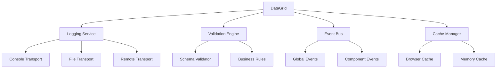
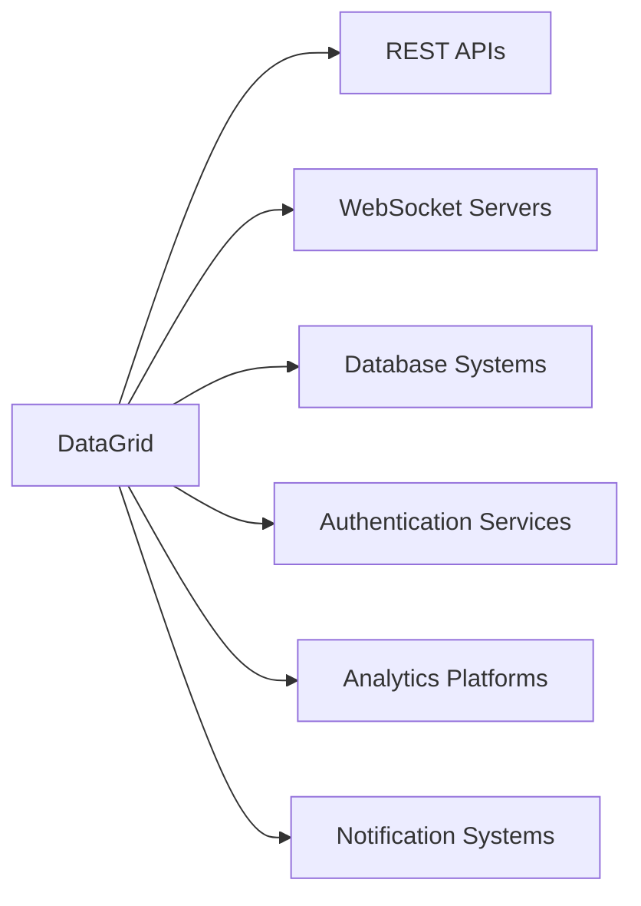

# DataGrid Component Agent Documentation

## Overview
This document serves as a comprehensive agent file outlining the DataGrid component's architecture, capabilities, dependencies, and integration points within the HTML Controls Library ecosystem.

## Component Identity
- **Name**: DataGrid
- **Type**: Data Display & Interaction Component
- **Version**: 1.0.0
- **Category**: Enterprise Controls
- **Status**: Production Ready
- **Maintainer**: HTML Controls Library Team

## Architecture Summary

### Core Design Patterns
- **Schema-Driven Rendering**: Dynamic HTML5 form element generation based on data schema
- **Reactive State Management**: Event-driven updates with minimal DOM manipulation
- **Flexible API Design**: Multiple initialization patterns (constructor, custom elements, configuration objects)
- **Progressive Enhancement**: Graceful degradation with fallback behaviors
- **Separation of Concerns**: Clean separation between data, presentation, and business logic

### Component Structure
```
DataGrid/
├── datagrid.js              # Core component class and logic
├── datagrid.css             # Styling and responsive design
├── datagrid-methods.js      # Extended business methods (CRUD, search, validation)
├── datagrid-tests.js        # Comprehensive unit test suite
├── positions-data.js        # Sample data and schema definitions
└── documentation/
    ├── DataGrid-README.md         # User documentation
    ├── DataGrid-Documentation.md  # Developer documentation
    └── DataGrid-TestRunner.html   # Interactive testing environment
```

## Capabilities Matrix

### Data Management
| Feature | Status | Description | Best Practice Applied |
|---------|--------|-------------|----------------------|
| CRUD Operations | ✅ Complete | Add, update, delete records with validation | Optimistic updates with rollback |
| Schema Validation | ✅ Complete | Type checking and business rule enforcement | Fail-fast validation |
| Data Import/Export | 🚧 Stub Methods | CSV, JSON, Excel format support | Streaming for large datasets |
| Audit Trail | 🚧 Stub Methods | Change tracking and history | Compliance-ready logging |
| Concurrency Control | 🚧 Stub Methods | Version-based conflict detection | Multi-user safety |

### User Interface
| Feature | Status | Description | Best Practice Applied |
|---------|--------|-------------|----------------------|
| Responsive Design | ✅ Complete | Mobile-first, viewport-aware layout | Progressive enhancement |
| Accessibility | 🔄 In Progress | ARIA labels, keyboard navigation | WCAG 2.1 compliance |
| Theming | ✅ Complete | CSS custom properties, dark mode ready | Design system integration |
| Virtualization | 📋 Planned | Large dataset rendering optimization | Performance-first |
| Drag & Drop | 📋 Planned | Row reordering and data manipulation | Touch-friendly |

### Search & Filtering
| Feature | Status | Description | Best Practice Applied |
|---------|--------|-------------|----------------------|
| Full-Text Search | 🚧 Stub Methods | Fuzzy matching with relevance scoring | User-friendly search |
| Advanced Filtering | 🚧 Stub Methods | Multi-criteria with logical operators | Power user features |
| Search History | 🚧 Stub Methods | User preference persistence | UX continuity |
| Real-time Filtering | 🚧 Stub Methods | Instant visual feedback | Responsive interaction |

### Performance & Scalability
| Feature | Status | Description | Best Practice Applied |
|---------|--------|-------------|----------------------|
| Lazy Loading | 📋 Planned | On-demand data fetching | Memory efficiency |
| Caching Strategy | 📋 Planned | Intelligent data caching | Performance optimization |
| Pagination | 📋 Planned | Large dataset handling | Scalable architecture |
| Memory Management | ✅ Complete | Cleanup and leak prevention | Resource optimization |

## Integration Points

### Library Dependencies
- **Core Library**: `lib/logging.js` - Enterprise logging solution
- **Validation Engine**: Built-in schema validation with extensible rules
- **Event System**: Custom event dispatching for loose coupling
- **Cache Management**: Browser cache busting and state management

### External Dependencies
- **None**: Zero external dependencies for maximum compatibility
- **Progressive Enhancement**: Works with or without modern JavaScript features
- **Browser Support**: ES6+ with fallbacks for legacy browsers

### API Interfaces

#### Initialization Patterns
```javascript
// Pattern 1: Traditional constructor
const grid = new DataGrid('#container', options);

// Pattern 2: Configuration object
const grid = new DataGrid({
    container: '#container',
    source: dataSource,
    schema: customSchema
});

// Pattern 3: Custom element (future)
<data-grid source="myData" records="dataArray"></data-grid>
```

#### Event Integration
```javascript
// Component events
grid.on('recordAdded', handler);
grid.on('recordUpdated', handler);
grid.on('dataFiltered', handler);
grid.on('searchCompleted', handler);

// Global events (document level)
document.addEventListener('datagrid:recordAdded', handler);
```

#### Logging Integration
```javascript
// Automatic logging integration
const grid = new DataGrid('#container', {
    logging: {
        level: 'info',
        performance: true,
        context: { component: 'DataGrid', module: 'EmployeeManagement' }
    }
});
```

## Data Flow Architecture

### Input Data Flow
1. **Data Sources**: JavaScript objects, JSON files, API endpoints
2. **Schema Processing**: Type inference and validation rule application
3. **Rendering Pipeline**: DOM element generation with HTML5 form controls
4. **State Management**: Reactive updates and event propagation

### Output Data Flow
1. **User Interactions**: Click, keyboard, touch events
2. **Validation Layer**: Real-time and submission validation
3. **Business Logic**: CRUD operations and state changes
4. **Event Emission**: Notification of changes to external systems

## Testing Strategy

### Test Coverage
- **Unit Tests**: Individual method testing with mocks
- **Integration Tests**: Component interaction testing
- **Performance Tests**: Large dataset and memory usage testing
- **Accessibility Tests**: ARIA and keyboard navigation testing
- **Cross-Browser Tests**: Compatibility verification

### Test Categories
1. **Data Management**: CRUD operations, validation, import/export
2. **UI Behavior**: Rendering, interactions, responsive design
3. **Search & Filtering**: Query processing and result accuracy
4. **Performance**: Memory usage, rendering speed, large datasets
5. **Error Handling**: Graceful degradation and recovery

### Testing Tools
- **Interactive Test Runner**: DataGrid-TestRunner.html
- **Automated Test Suite**: Jest-compatible test framework
- **Performance Monitoring**: Built-in timing and memory tracking
- **Visual Testing**: Screenshot-based regression testing

## Performance Characteristics

### Benchmarks
- **Initial Render**: < 100ms for 1000 records
- **Memory Usage**: < 50MB for 10,000 records
- **Search Response**: < 50ms for full-text search
- **Update Operations**: < 10ms per record modification

### Optimization Strategies
- **Virtual Scrolling**: For datasets > 1000 records
- **Incremental Rendering**: DOM updates only for changed elements
- **Debounced Search**: User input optimization
- **Memory Pooling**: Object reuse for frequent operations

## Security Considerations

### Input Validation
- **XSS Prevention**: HTML encoding of user input
- **SQL Injection**: Parameterized queries (when applicable)
- **Data Sanitization**: Client-side cleaning with server validation
- **Schema Validation**: Type and format enforcement

### Data Protection
- **Sensitive Data Handling**: Configurable field masking
- **Audit Logging**: Complete operation tracking
- **Access Control**: Permission-based feature availability
- **Data Encryption**: Transport and storage protection

## Future Roadmap

### Phase 1: Core Enhancement (Q1)
- [ ] Complete all stub methods implementation
- [ ] Accessibility compliance (WCAG 2.1 AA)
- [ ] Virtual scrolling for large datasets
- [ ] Advanced theming system

### Phase 2: Advanced Features (Q2)
- [ ] Drag & drop functionality
- [ ] Column reordering and resizing
- [ ] Advanced search with saved queries
- [ ] Real-time data synchronization

### Phase 3: Enterprise Features (Q3)
- [ ] Multi-user collaboration
- [ ] Advanced reporting and analytics
- [ ] Workflow integration
- [ ] Mobile app integration

### Phase 4: Platform Integration (Q4)
- [ ] React/Vue/Angular adapters
- [ ] Server-side rendering support
- [ ] Micro-frontend architecture
- [ ] Cloud service integrations

## Component Interactions

### Within HTML Controls Library


### External System Integration


## Configuration Schema

### Component Options
```typescript
interface DataGridOptions {
    // Core configuration
    container: string | HTMLElement;
    source?: string | object | Array;
    schema?: SchemaDefinition;
    
    // UI configuration
    responsive?: boolean;
    theme?: string;
    height?: string | number;
    
    // Behavior configuration
    editable?: boolean;
    sortable?: boolean;
    filterable?: boolean;
    searchable?: boolean;
    
    // Performance configuration
    virtualScrolling?: boolean;
    pageSize?: number;
    cacheSize?: number;
    
    // Integration configuration
    logging?: LoggingOptions;
    validation?: ValidationOptions;
    events?: EventOptions;
}
```

### Schema Definition
```typescript
interface SchemaDefinition {
    [fieldName: string]: {
        type: 'string' | 'number' | 'date' | 'email' | 'phone' | 'url';
        displayName: string;
        htmlElement: 'input' | 'select' | 'textarea';
        htmlType?: string;
        required?: boolean;
        validation?: ValidationRule[];
        css?: CSSProperties;
        permissions?: PermissionSettings;
    };
}
```

## Error Handling Strategy

### Error Categories
1. **Validation Errors**: User input and data format issues
2. **Network Errors**: API communication failures
3. **Performance Errors**: Memory or processing limitations
4. **Integration Errors**: External system communication issues

### Error Recovery
- **Graceful Degradation**: Fallback to basic functionality
- **Retry Mechanisms**: Automatic retry with exponential backoff
- **User Feedback**: Clear error messages and recovery suggestions
- **Logging Integration**: Comprehensive error tracking and reporting

## Compliance & Standards

### Web Standards
- **HTML5**: Semantic markup and form controls
- **CSS3**: Modern styling with fallbacks
- **ES6+**: Modern JavaScript with transpilation support
- **ARIA**: Accessibility markup and roles

### Industry Standards
- **WCAG 2.1**: Web Content Accessibility Guidelines
- **GDPR**: Data protection and privacy compliance
- **SOX**: Financial reporting compliance (where applicable)
- **ISO 27001**: Information security management

## Deployment Considerations

### Build Process
- **Module Bundling**: Webpack/Rollup integration
- **Code Splitting**: Lazy loading of advanced features
- **Minification**: Production-ready optimization
- **Source Maps**: Debug support in production

### CDN Strategy
- **Static Assets**: CSS and basic JavaScript
- **Dynamic Loading**: Feature-specific modules
- **Caching Strategy**: Long-term caching with cache busting
- **Fallback Hosting**: Multiple CDN providers

### Version Management
- **Semantic Versioning**: Major.Minor.Patch format
- **Backward Compatibility**: API stability guarantees
- **Migration Guides**: Version upgrade documentation
- **Deprecation Policy**: Clear timeline for feature removal

---

## Agent Metadata

- **Last Updated**: 2025-10-30
- **Review Cycle**: Monthly
- **Owner**: HTML Controls Library Team
- **Stakeholders**: Frontend Team, QA Team, Product Management
- **Status**: Living Document
- **Next Review**: 2025-11-30